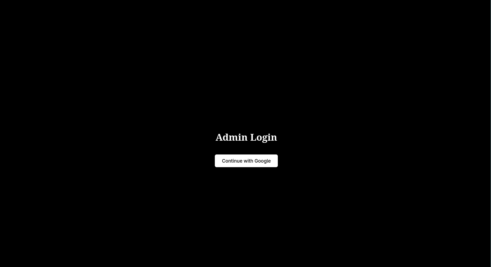

# OAuth in Payload CMS

## Quick Setup (No Explanation)

If you want to use this directly without going through the details, follow these steps:

- Go to **`payload.config.ts`**
  - Copy my code
  - Add your own **collections** and **globals**

- Go to **`User.ts`**
  - Copy my code exactly

- Copy the folder **`src/app/admin`** into the **same exact location** in your project

- Copy the folder **`/payload/api`** into the **same exact location** in your project

- Copy the **`.env`** file and fill in all required OAuth and Payload credentials

Explantion coming soon

